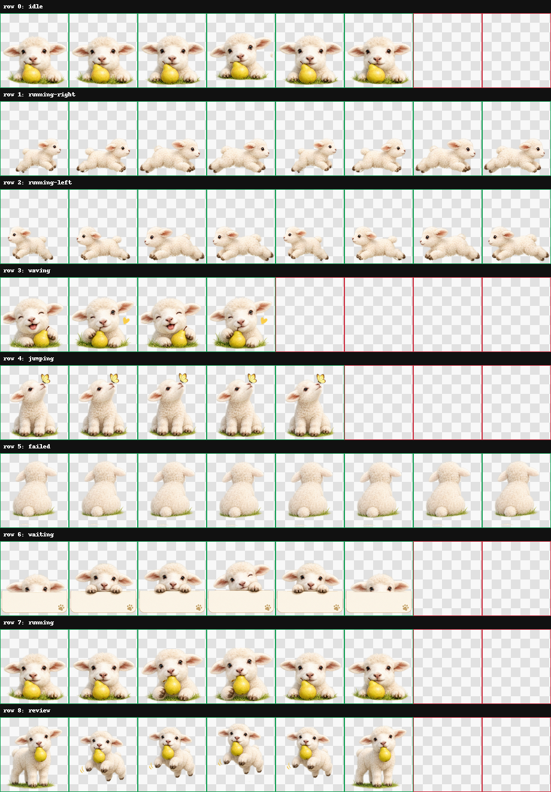

# Pear Lamb Codex Pet

A gentle ivory baby lamb desktop pet that carries its favorite pear.



## Install without a ZIP

### ChatGPT on the web

1. Open [`spritesheet.webp`](spritesheet.webp).
2. Select **Download raw file**.
3. In ChatGPT, open **Settings → Personalization → Pet → Upload pet**.
4. Upload the downloaded WebP file.

### ChatGPT desktop floating pet

1. Download [`pet.json`](pet.json) and [`spritesheet.webp`](spritesheet.webp).
2. Create this folder and place both files inside it:

   ```text
   Windows: %USERPROFILE%\.codex\pets\pear_lamb_v1\
   macOS/Linux: ~/.codex/pets/pear_lamb_v1/
   ```

3. Open **Settings → Pets**, select **Refresh**, and choose **Pear Lamb**.
4. Enter `/pet` to wake it.

Official pet documentation: <https://learn.chatgpt.com/docs/pets>

## Actions

- Calm idle look-around
- Left and right running while dragged
- Happy greeting and wink
- Butterfly-curiosity hover
- Shy turn-away when blocked
- Sign peek when input is needed
- Quiet pear inspection while working
- Pear jump when work is ready

The sprite sheet is transparent WebP, 1536 × 1872 pixels, using the Codex custom-pet v1 layout.

## 中文安装

网页端只需下载 [`spritesheet.webp`](spritesheet.webp)，然后进入 **设置 → 个性化 → 宠物 → 上传宠物**。

桌面浮动宠物需要同时下载 `pet.json` 和 `spritesheet.webp`，放入：

```text
%USERPROFILE%\.codex\pets\pear_lamb_v1\
```

随后在 **设置 → 宠物** 中刷新并选择 Pear Lamb，输入 `/pet` 唤醒。

## Usage rights

Shared for personal use as a ChatGPT/Codex pet. No commercial-use or resale rights are granted. Contact the repository owner before redistributing the artwork or using it commercially.
